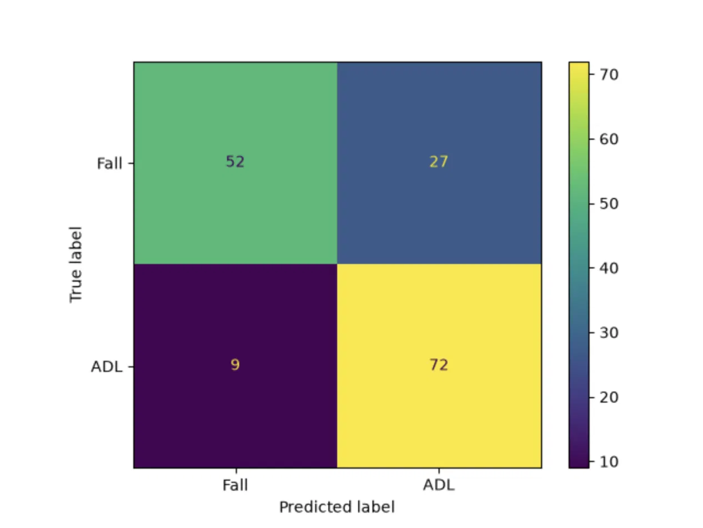

# Cross-Dataset Generalization Test

The number in the main README (91% accuracy, 0.89 fall recall) comes from a held-out split of FallVision, the dataset the model was trained on. That shows the model learned FallVision. It doesn't show whether it generalizes to a new camera, a new room, or people it's never seen, which is what actually matters for a real deployment. So I ran the trained model against GMDCSA24, a fall detection dataset built by a different research group, with different subjects, cameras, and rooms, never seen during training or model selection.

## Setup

- Dataset: GMDCSA24 (Alam et al., 2024), 4 subjects, 160 videos, split close to evenly between Fall and ADL (Activities of Daily Living).
- Pose extraction: my own YOLOv8-pose pipeline (`mov_to_csv` in `helper_functions.py`), not GMDCSA24's own keypoint annotations. This tests the full pipeline end to end, extraction included, not just the classifier on pre-cleaned input.
- Model: `best_model.pth`, trained on FallVision, no fine-tuning and no retraining on GMDCSA24.

## Results



| Class        | Precision | Recall | F1-score | Support |
|--------------|-----------|--------|----------|---------|
| Fall         | 0.85      | 0.66   | 0.74     | 79      |
| ADL          | 0.73      | 0.89   | 0.80     | 81      |
| **Accuracy** |           |        | **0.78** | 160     |
| Macro avg    | 0.79      | 0.77   | 0.77     | 160     |
| Weighted avg | 0.79      | 0.78   | 0.77     | 160     |

## Reading the numbers

ADL detection holds up well: 72 of 81 no-fall videos are correctly identified, a 0.89 recall in line with the FallVision result. Fall recall is where the model takes a real hit, dropping from 0.89 on FallVision to 0.66 here, 52 of 79 falls caught. Precision on the Fall class stays reasonable at 0.85, so the model isn't flagging ADL clips as falls any more than before. It's specifically missing falls it would have caught on its own training distribution.

That gap is domain shift, not a pipeline bug (the normalization mismatch mentioned in the README's "Key engineering findings" section was caught and fixed before it ever touched a trained checkpoint, so it doesn't explain this result). GMDCSA24's falls were staged by different people, on different floors, with a different camera setup than FallVision. Whatever combination of motion patterns the model keyed on for "this is a fall" doesn't fully carry over. A missed-fall rate that triples on a same-task dataset from a different source is the kind of thing that would show up as real missed emergencies on a device deployed to a household that looks nothing like FallVision's recording setup.

Most portfolio fall-detection projects report one clean test-set number and stop there. A single held-out split from the training dataset can only tell you how well the model memorized that dataset's distribution, not whether it generalizes. This is the number I'd actually quote as the model's real-world reliability, not 91%.

## Reproducing this

```bash
python src/predict.py
```

Run from the repository root. Edit the `datafolder`, `fall_folder_name`, and `nofall_folder_name` arguments at the bottom of `src/predict.py` to point at wherever you've downloaded GMDCSA24, organized into per-class subfolders.

## Dataset citation

E. Alam, A. Sufian, P. Dutta, M. Leo, I. A. Hameed, "GMDCSA24: A Dataset for Human Fall Detection in Videos," *Data in Brief* (2024). Dataset DOI: [10.5281/zenodo.12921216](https://doi.org/10.5281/zenodo.12921216).
